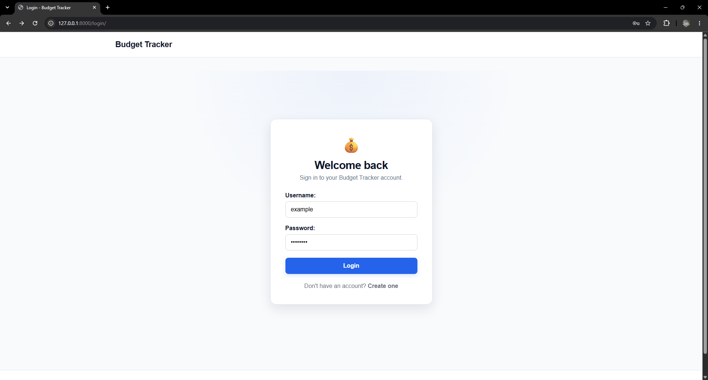
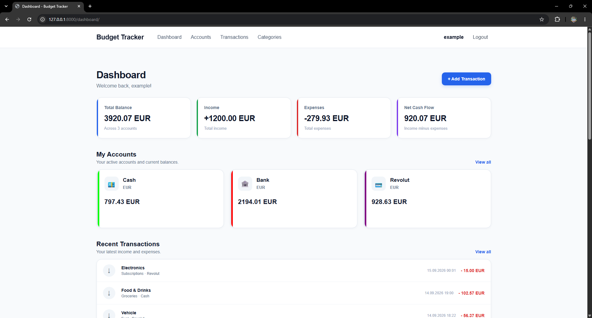
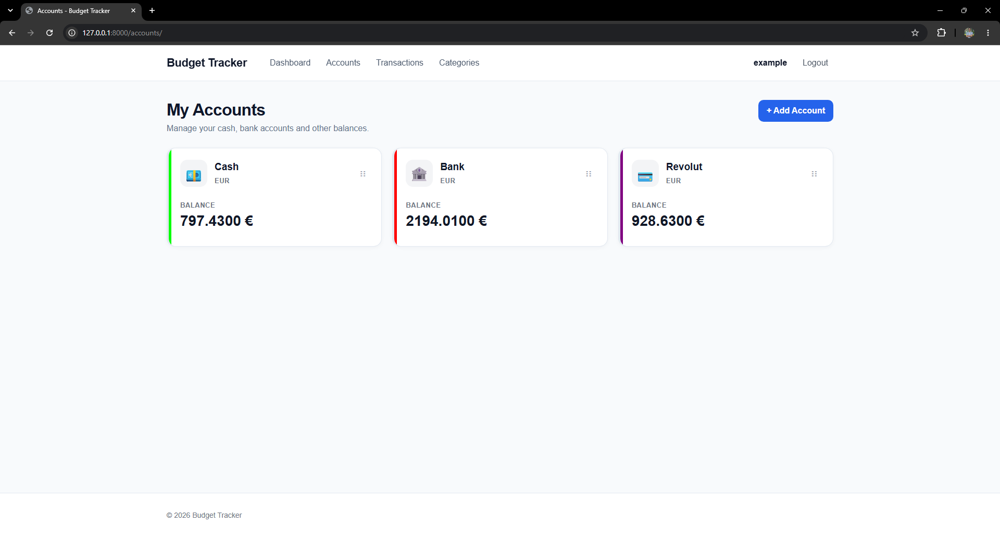
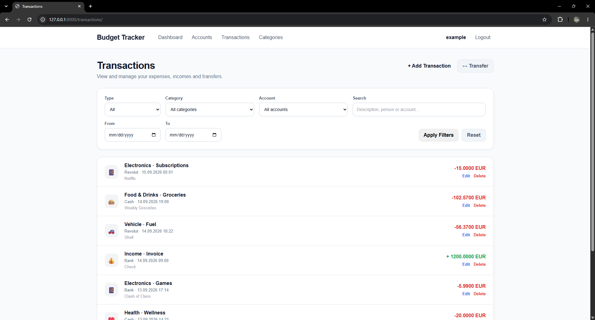
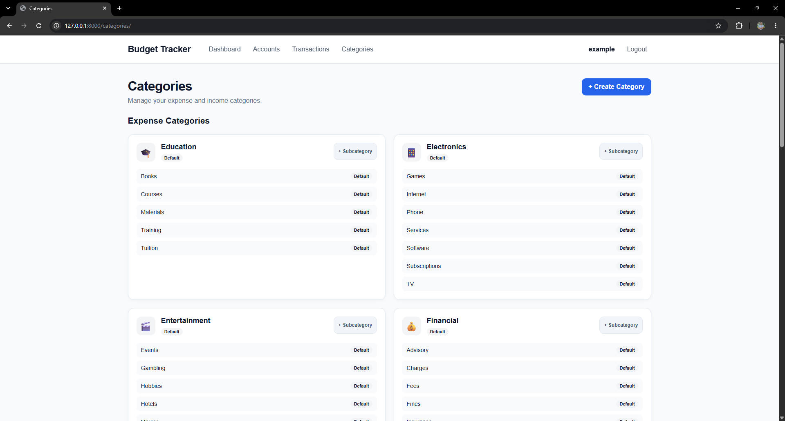
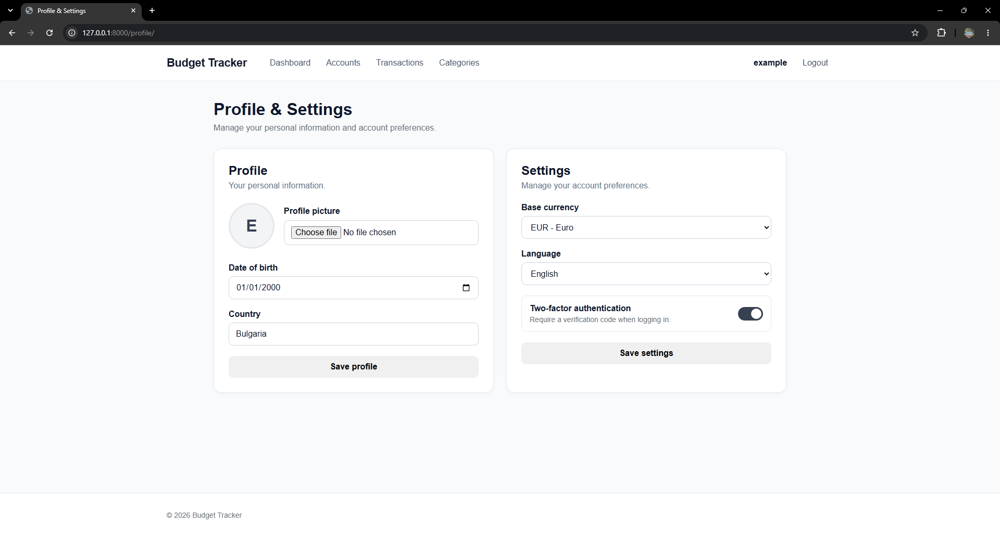
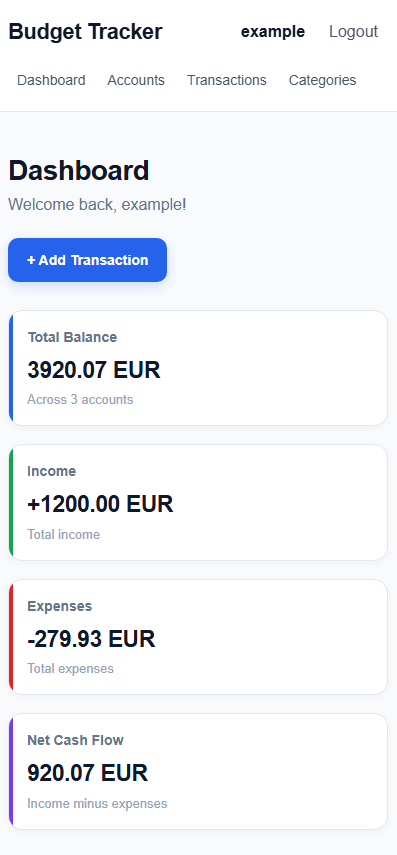

# Budget Tracker

A full-stack personal finance management web application built with Django and PostgreSQL.

Budget Tracker allows users to manage their personal finances by tracking accounts, income, expenses, transfers, categories, currencies, and monthly financial statistics through a responsive web interface.

The project was developed as a diploma thesis project for the Technical University of Sofia.

---

## Features

### Authentication & User Management

- User registration and login
- Password hashing using Django's authentication system
- Email verification
- Two-factor authentication (2FA) using email verification codes
- Session-based authentication
- User profile management
- Profile picture upload
- Date of birth and country information
- Base currency selection
- Bulgarian and English language support
- Secure handling of verification tokens and 2FA codes

### Account Management

- Create multiple financial accounts
- Support for different account types, such as:
  - Cash
  - Bank
  - Voucher
  - Revolut
  - and other custom account types
- Account-specific currencies
- Opening and current balances
- Custom account colors
- Emoji-based account identification
- Drag-and-drop account ordering
- Account activation/deactivation
- Complete account transaction history
- Automatic balance updates based on financial operations

### Transactions

- Record income and expenses
- Assign categories and subcategories
- Transaction amount and currency
- Transaction date and time
- Person/contact associated with a transaction
- Optional transaction description
- Automatic account balance updates
- Transaction history
- Filtering and searching
- Responsive transaction interface

### Transfers

- Transfer money between accounts
- Support for accounts with different currencies
- Source and destination amounts
- Exchange rate handling
- Transfer descriptions
- Transfer date and time
- Atomic balance updates
- Transfers are kept separate from income and expense statistics

### Categories

The application provides predefined financial categories and allows users to create custom categories and subcategories.

#### Expense Categories

- Food & Drinks
- Shopping
- Housing
- Transportation
- Vehicle
- Entertainment
- Health
- Education
- Electronics
- Financial

#### Income Categories

- Income

Users can also create their own custom categories and subcategories.

### Dashboard & Statistics

- Current account balances
- Total income
- Total expenses
- Net cash flow
- Monthly financial statistics
- Income and expense charts
- Account overview
- Monthly transaction data
- Empty states for periods without financial activity

### Internationalization

The application supports:

- English
- Bulgarian

Language selection is associated with the authenticated user's profile.

### Responsive Design

The interface is designed for:

- Desktop screens
- Laptop screens
- Mobile devices

The application uses responsive HTML and CSS layouts together with JavaScript interactions.

---

## Tech Stack

### Backend

- Python 3.14
- Django 6.0
- Django ORM
- PostgreSQL 18
- psycopg 3
- django-environ

### Frontend

- HTML5
- CSS3
- JavaScript
- Django Templates
- Chart.js

### Development Tools

- Git
- GitHub
- Visual Studio Code

### Testing

- Django Test Framework
- 219 automated tests

---

## Architecture

The project follows a modular Django application structure.

Main applications include:

- `users` — authentication, profiles, email verification and 2FA
- `accounts` — financial account management
- `transactions` — income, expenses and transfers
- `categories` — categories and subcategories
- `dashboard` — financial overview and statistics
- `core` — shared models and application functionality

The project uses Django's Model-View-Template (MVT) architecture.

---

## Project Structure

```text
budget-tracker/
│
├── apps/
│   ├── accounts/
│   ├── categories/
│   ├── core/
│   ├── dashboard/
│   ├── transactions/
│   └── users/
│
├── config/
│   ├── settings.py
│   ├── urls.py
│   ├── asgi.py
│   └── wsgi.py
│
├── locale/
│   └── bg/
│       └── LC_MESSAGES/
│
├── static/
│
├── templates/
│
├── .gitignore
├── manage.py
├── README.md
└── LICENSE
```

---

## Database

Budget Tracker uses PostgreSQL as its relational database.

The application contains models for:

- Users
- Profiles
- Currencies
- Accounts
- Categories
- Subcategories
- Transactions
- Transfers
- Exchange rates
- Email verification tokens
- Two-factor authentication codes

The application uses Django migrations to manage database schema changes.

---

## Requirements

Before running the project, make sure the following are installed:

- Python 3.14 or compatible Python version
- PostgreSQL 18
- Git

---

## Installation

### 1. Clone the repository

```bash
git clone https://github.com/skanchev03/budget-tracker.git
cd budget-tracker
```

### 2. Create a virtual environment

Windows:

```powershell
python -m venv .venv
```

Activate it:

```powershell
.\.venv\Scripts\Activate.ps1
```

### 3. Install dependencies

```powershell
pip install -r requirements.txt
```

### 4. Create the PostgreSQL database

Create a PostgreSQL database named:

```text
budget_tracker
```

Make sure PostgreSQL is running before starting the application.

### 5. Configure environment variables

Create a `.env` file in the project root.

Example:

```env
SECRET_KEY=your-secret-key
DEBUG=True

ALLOWED_HOSTS=127.0.0.1,localhost

DB_NAME=budget_tracker
DB_USER=postgres
DB_PASSWORD=your-postgresql-password
DB_HOST=localhost
DB_PORT=5432

SITE_URL=http://127.0.0.1:8000

EMAIL_BACKEND=django.core.mail.backends.console.EmailBackend
EMAIL_HOST=
EMAIL_PORT=587
EMAIL_USE_TLS=True
EMAIL_HOST_USER=
EMAIL_HOST_PASSWORD=
DEFAULT_FROM_EMAIL=noreply@budgettracker.local
```

> Never commit the `.env` file to GitHub. It is intentionally excluded by `.gitignore`.

### 6. Apply migrations

```powershell
python manage.py migrate
```

### 7. Run the development server

```powershell
python manage.py runserver
```

The application will be available at:

```text
http://127.0.0.1:8000/
```

---

## Email Development Mode

During local development, the application uses Django's console email backend.

This means that verification emails and 2FA codes are displayed directly in the terminal instead of being sent through an external email provider.

This configuration is intended for development and testing.

For production deployment, a real email service should be configured through environment variables.

---

## Running Tests

The project contains a comprehensive automated test suite covering the main application functionality.

Run all tests with:

```powershell
python manage.py test apps
```

Current test status:

```text
219 tests
219 passed
0 failed
```

The test suite covers areas including:

- User authentication
- Registration
- Email verification
- Two-factor authentication
- User profiles
- Accounts
- Account balances
- Transactions
- Transfers
- Categories
- Dashboard statistics
- Internationalization
- Security-related behavior

---

## Security

The application follows Django security best practices and includes:

- Password hashing through Django authentication
- CSRF protection
- HTTP-only session cookies
- Content type protection
- Clickjacking protection
- Environment-based secret configuration
- Secure production cookie configuration
- HTTPS redirection in production mode
- HSTS configuration for production
- Hashed email verification tokens
- Hashed two-factor authentication codes
- User ownership checks for financial data
- Atomic database operations for balance-changing operations

Sensitive configuration values are stored outside the source code using environment variables.

---

## Supported Currencies

The initial version of the application supports:

- EUR — Euro
- GBP — British Pound
- USD — US Dollar

The database architecture allows additional currencies to be added in the future.

---

## Financial Data Model

Account balances are maintained using financial operations as the source of truth.

The conceptual balance calculation is:

```text
Current Balance =
Opening Balance
+ Income
- Expenses
+ Transfers In
- Transfers Out
```

Transactions and transfers are processed using atomic database operations to help maintain balance consistency.

Transfers are excluded from income and expense statistics to prevent double-counting.

---

## Screenshots

### Login



### Dashboard



### Accounts



### Transactions



### Categories



### Profile & Settings



### Mobile Dashboard



---

## Development Status

### Version 1.0

The core functionality of Budget Tracker v1.0 has been implemented and tested.

Current status:

- Authentication: Complete
- User profiles: Complete
- Email verification: Complete
- 2FA: Complete
- Accounts: Complete
- Transactions: Complete
- Transfers: Complete
- Categories: Complete
- Dashboard: Complete
- Internationalization: Complete
- Responsive UI: Complete
- Automated tests: Complete
- Git version control: Complete
- GitHub repository: Complete

---

## Future Improvements

Potential future improvements include:

- Production deployment
- Real email provider integration
- Additional currencies
- Advanced financial reports
- Export to CSV/PDF
- Budget limits and spending goals
- Recurring transactions
- Advanced filtering and reporting
- More detailed data visualizations
- API integration
- Automated backups

---

## License

This project is licensed under the MIT License.

See the [LICENSE](LICENSE) file for details.

---

## Author

**Stefan Kanchev**

Diploma thesis project  
Technical University of Sofia

GitHub:

https://github.com/skanchev03